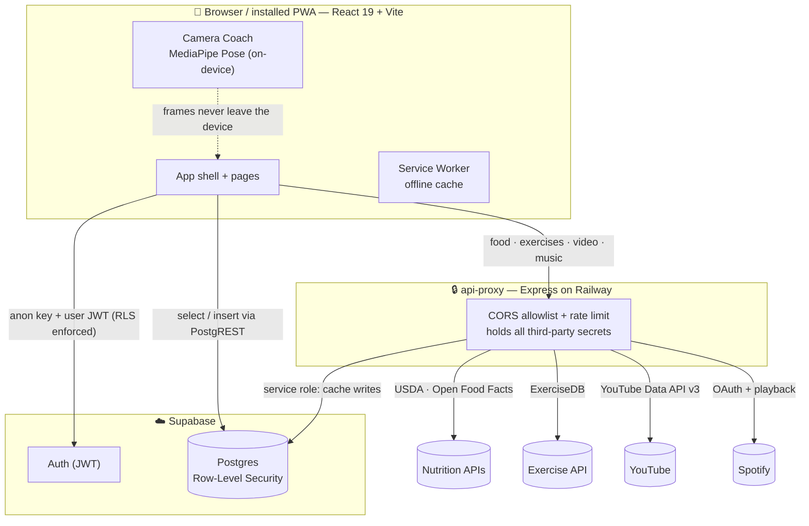

<!--
  Before you publish: replace OWNER below with your GitHub username (badges + clone URL),
  add a LICENSE file, and set the deploy secrets listed in "Going to production".
-->

<div align="center">

# WorkIn.ai

### It's not a workout. It's a WorkIN.

A hypertrophy-focused training **and** nutrition PWA for serious lifters — block periodization,
mood-adaptive sessions, on-device AI form coaching, and food tracking, in one calm daily ritual.

[](https://github.com/cnchapa0018/workout-tracker/actions/workflows/ci.yml)
[](https://github.com/cnchapa0018/workout-tracker/actions/workflows/security-scan.yml)
[](https://github.com/cnchapa0018/workout-tracker/actions/workflows/codeql.yml)


**[▶︎ Try the live demo](https://YOUR-DEPLOYED-URL)** &nbsp;·&nbsp; no install — sign up and start logging.
<br/>Just want to look around? Hit **"Try as guest"** on the landing page for a seeded demo (no account, no setup).

</div>

---

## What it is

WorkIn.ai is a [Progressive Web App](https://web.dev/progressive-web-apps/) for experienced lifters who
want structure without spreadsheets. It generates **periodized training blocks**, adapts each session to
how you actually feel that day, tracks **protein and calories** against a target that updates with your
bodyweight, and can watch your form through your phone camera — all **on-device**, with nothing uploaded.

It's a single-page React app backed by Supabase (Postgres + Auth, with strict Row-Level Security), plus a
small Express **api-proxy** that keeps third-party API keys off the client.

<div align="center">

### 📸 A look inside


<table>
  <tr>
    <td align="center"><br/><sub><b>Home — your daily ritual</b></sub></td>
    <td align="center"><br/><sub><b>Set-by-set logging</b></sub></td>
    <td align="center"><br/><sub><b>Protein-first nutrition</b></sub></td>
    <td align="center"><br/><sub><b>On-device Camera Coach</b></sub></td>
  </tr>
  <tr>
    <td align="center"><br/><sub><b>Mood-adaptive &amp; periodized</b></sub></td>
    <td align="center"><br/><sub><b>Block-periodized program</b></sub></td>
    <td align="center"><br/><sub><b>Volume &amp; progress</b></sub></td>
    <td align="center"><br/><sub><b>Exercise library</b></sub></td>
  </tr>
</table>

<sub><i>Screens captured from the built-in guest/demo mode — see them live via <b>“Explore the demo — no account”</b> on the login screen.</i></sub>

</div>

---

## ✨ Features

<details open>
<summary><strong>🏋️ Training</strong></summary>

- **Block periodization** — auto-generated mesocycles (4–8 weeks) with RIR-based intensity, rep-range
  targets, and scheduled deload weeks across Upper/Lower, Push/Pull/Legs, or Full-Body splits.
- **Mood-adaptive sessions** — before each workout you set energy/mood/time available; the engine trims
  volume, swaps exercises, or shortens the session to match your capacity that day.
- **Set-by-set logging** — weight, reps, and RIR per set, with last-session performance and progression
  hints surfaced inline for anchor lifts.
- **Progressive-overload tracking** — detects stalls and prompts the right next step (add reps, drop RIR,
  or add load).
- **Exercise library & swaps** — 2,500+ exercises filterable by body part / equipment, with in-session
  swaps constrained to the same movement pool so anchor lifts persist.
- **Micro-variation** — non-anchor exercises rotate weekly within their movement pool to keep stimulus
  fresh without losing consistency.
- **Training modes** — full gym, Smith-machine, or lower-fatigue; switching regenerates the program with
  appropriate substitutions.
- **Cardio logging** and **downloadable program PDFs** for offline reference.

</details>

<details>
<summary><strong>🥗 Nutrition</strong></summary>

- **Food search** across USDA FoodData Central and Open Food Facts, plus **barcode lookup** and manual
  entry — logged by meal (breakfast / lunch / dinner / snack).
- **Protein is the hero metric** — calories, protein, carbs, and fat tracked against a personalized target.
- **Adaptive calorie target** — recomputed from your 7-day rolling intake and goal (build / maintain / cut).
- **Bodyweight tracking** with trend visualization that feeds back into your targets.

</details>

<details>
<summary><strong>🎯 AI Camera Coach <em>(on-device, privacy-first)</em></strong></summary>

- Real-time **pose landmark detection** via [MediaPipe Tasks Vision](https://ai.google.dev/edge/mediapipe)
  for push-ups, squats, lunges, planks, and bicep curls.
- Automatic **rep counting**, joint-angle readouts, and form cues.
- Optional **RF-DETR object detection** for equipment recognition (remote endpoint or mock fallback).
- **No video ever leaves your device** — only derived metadata (rep counts, tempo, confidence) is stored.

</details>

<details>
<summary><strong>📊 Analytics & insights</strong></summary>

- Seven-tab dashboard: **Volume**, **Exercise Progression**, **Workout Streak**, **Bodyweight Trend**,
  **Recovery Ratings**, **Nutrition Trends**, and **Mood Correlation** (charts via Recharts).
- **Recovery intelligence** — post-session self-assessment, automatic deload at block end, and warnings
  when recovery trends poor.
- **In-app education** — exercise insights (form cues, common mistakes) and concept tooltips (RIR, RPE,
  progressive overload, …).

</details>

<details>
<summary><strong>📱 Platform & PWA</strong></summary>

- **Installable** on iOS and Android (manifest, maskable icons, standalone display, safe-area/notch support).
- **Offline-capable** service worker (network-first HTML, cache-first hashed assets) with in-progress
  session persistence.
- **Light / dark / system** theming with flash-free initialization.
- **Spotify integration** — mood-matched playlist recommendations and in-app playback.
- **Smart notifications** — rest-day reminders, low-protein warnings, recovery-trend alerts.

</details>

---

## 🏗️ Architecture



**Why the proxy?** The browser only ever holds the Supabase **anon** key (safe — every row is gated by
RLS). API keys with real cost or privilege (USDA, YouTube, Spotify secret, Supabase **service role**) live
exclusively in the api-proxy, which adds a CORS origin allowlist and a 100-req/min rate limit.

---

## 🧰 Tech stack

| Layer | Tech |
|---|---|
| Frontend | React 19, React Router v7, Vite 6, TypeScript 5.9, Tailwind CSS v4 |
| Charts / PDF / Icons | Recharts, jsPDF, Lucide |
| Vision | `@mediapipe/tasks-vision` (Pose Landmarker), optional RF-DETR |
| Backend data | Supabase (Postgres, Auth, Row-Level Security) via `@supabase/supabase-js` |
| API proxy | Node 22, Express, `cors`, `express-rate-limit` |
| Tests | Vitest (node env) |
| Hosting | Railway (frontend + api-proxy), Supabase (managed Postgres) |
| CI/CD | GitHub Actions (CI, security scanning, CodeQL, deploys) |

---

## 🚀 Quick start

### Prerequisites

- **Node.js 22+** and npm
- **Docker** (for local Supabase) and the **Supabase CLI** — `npm install -g supabase`

### 1 — Clone & install

```bash
git clone https://github.com/cnchapa0018/workout-tracker.git
cd workout-tracker
npm install
```

### 2 — Start local Supabase

```bash
supabase start          # boots Postgres on :54322, API on :54321, applies all migrations
```

Copy the printed **API URL** and **anon key** for the next step. (Need the service-role key later?
`supabase status` prints it.)

### 3 — Configure the frontend

```bash
cp .env.example .env.local
```

```ini
# .env.local
VITE_SUPABASE_URL=http://127.0.0.1:54321
VITE_SUPABASE_ANON_KEY=<local anon key from `supabase start`>
VITE_API_PROXY_URL=http://localhost:3001
```

### 4 — Run the api-proxy _(optional, only for food / exercise / video / music features)_

```bash
cd api-proxy
npm install
cp .env.example .env   # then fill in the keys you have (all optional for a first run)
npm run dev            # http://localhost:3001
cd ..
```

### 5 — Run the app

```bash
npm run dev            # http://127.0.0.1:7000
```

> The frontend boots fine without the api-proxy — you just won't get food search, exercise demos,
> YouTube videos, or Spotify until it's running with the relevant keys.

---

## 🚀 Deploy your own

Want your own independent instance (your data, your keys, your bill)? Three pieces:

1. **Database — Supabase.** Create a free project, then apply the schema:
   ```bash
   supabase link --project-ref <your-project-ref>
   supabase db push            # applies everything in supabase/migrations
   ```
   Grab the project **URL**, **anon key**, and **service-role key** from the Supabase dashboard.

2. **api-proxy — any Node host** (Railway, Render, Fly.io). Deploy the `api-proxy/` folder and set its
   server-side env vars (see the table below). [](https://railway.com/new)

3. **Frontend — any static host** (Railway, Vercel, Netlify, Cloudflare Pages). Build with `npm run build`
   and serve `dist/`. Set `VITE_SUPABASE_URL`, `VITE_SUPABASE_ANON_KEY`, and `VITE_API_PROXY_URL` (pointing
   at your deployed proxy).

> The anon key is **public by design** — it's meant to ship in the frontend build. Row-Level Security is
> what protects data, so each user only ever sees their own rows. The **service-role key stays in the
> api-proxy only** — never put it in the frontend or commit it.

---

## 🔑 Environment variables

**Frontend** (`.env.local`, prefixed `VITE_` so they're bundled into the client):

| Variable | Required | Purpose |
|---|:--:|---|
| `VITE_SUPABASE_URL` | ✅ | Supabase project / local API URL |
| `VITE_SUPABASE_ANON_KEY` | ✅ | Public anon key (safe in the browser — RLS enforces access) |
| `VITE_API_PROXY_URL` | ✅ | Base URL of the api-proxy |
| `VITE_FEATURE_CAMERA_COACH` | — | Feature-flag the AI Camera Coach |
| `VITE_MEDIAPIPE_WASM_BASE` | — | Override MediaPipe WASM asset base (defaults to CDN) |
| `VITE_POSE_MODEL_URL` | — | Override the pose model URL |
| `VITE_RF_DETR_ENDPOINT` | — | RF-DETR object-detection endpoint |
| `VITE_SPOTIFY_CLIENT_ID` | — | Public Spotify client ID for Web Playback |

**api-proxy** (`api-proxy/.env`, **server-side only — never exposed to the browser**):

| Variable | Required | Purpose |
|---|:--:|---|
| `SUPABASE_URL` | ✅ | Supabase URL for server-side cache writes |
| `SUPABASE_SERVICE_KEY` | ✅ | **Service-role** key — full DB access; keep secret |
| `SPOTIFY_CLIENT_ID` | ✅¹ | Spotify OAuth client ID |
| `SPOTIFY_CLIENT_SECRET` | ✅¹ | Spotify OAuth client secret |
| `SPOTIFY_REDIRECT_URI` | ✅¹ | Spotify OAuth redirect URI |
| `USDA_API_KEY` | — | USDA FoodData Central key (food search) |
| `YOUTUBE_API_KEY` | — | YouTube Data API v3 key (exercise videos) |
| `FRONTEND_ORIGIN` | — | CORS allowlist origin (defaults to `http://localhost:7000`) |
| `PORT` | — | Proxy port (defaults to `3001`) |

¹ Required only if you enable the Spotify feature.

> 🔒 `.env`, `.env.local`, and `api-proxy/.env` are git-ignored. Only `.env.example` (placeholders) is
> committed. **Never commit a real key** — the [secret-scanning CI job](#-cicd) will catch it on PRs.

---

## 📜 Scripts

| Command | Does |
|---|---|
| `npm run dev` | Vite dev server (`:7000`, HMR) |
| `npm run build` | Type-check (`tsc -b`) + production build to `dist/` |
| `npm run lint` | ESLint over `.ts` / `.tsx` |
| `npm run test` | Run the Vitest suite once |
| `npm run test:watch` | Vitest in watch mode |
| `npm run preview` | Serve the production build locally |
| `npm run import:exercises` | Import the free-exercise-db dataset |

---

## 🧪 Testing

Pure-logic units run under **Vitest** (node environment, no DOM). Suites cover the parts most likely to
break silently:

- `src/lib/*.test.ts` — adaptive TDEE, emphasis math, load math, program generator, volume landmarks
- `src/vision/**/*.test.ts` — analyzers, sensor fusion, object detection, pose logic

```bash
npm test
```

---

## 🔒 Security

WorkIn.ai handles personal health data, so security is designed in, not bolted on:

- **Row-Level Security everywhere.** Every user-owned table enforces `auth.uid() = user_id` (directly or
  via a hierarchical join). Shared reference tables are read-only to authenticated users. All client access
  uses the anon key over PostgREST — **no raw SQL, no `.rpc()`, no `SECURITY DEFINER`** — so there is no
  string-built-query injection surface.
- **Secrets stay server-side.** Privileged/billable keys (Supabase service role, YouTube, Spotify secret,
  USDA) live only in the api-proxy. The browser holds only the public anon key.
- **Hardened proxy.** CORS origin allowlist, `express-rate-limit` at 100 req/min per IP, JSON-only bodies,
  and a validated Spotify redirect-URI allowlist.
- **On-device vision.** Camera frames are processed locally via MediaPipe; only derived metadata is stored.
- **Automated scanning** on every PR — see below. Found a vulnerability? See [SECURITY.md](SECURITY.md).

---

## 🤖 CI/CD

| Workflow | Trigger | What it does |
|---|---|---|
| [`ci.yml`](.github/workflows/ci.yml) | PRs → `main`/`staging` | Type-check, lint, build (frontend + api-proxy), Supabase migration apply + schema-drift check |
| [`security-scan.yml`](.github/workflows/security-scan.yml) | PRs, push to `main`, weekly | SAST, dependency audit, secret scan, SQLi detection, license check, Actions hardening audit, SBOM + container build, summary |
| [`codeql.yml`](.github/workflows/codeql.yml) | PRs, push to `main`, weekly | GitHub CodeQL static analysis (JS/TS), results in the **Security** tab |
| [`deploy-production.yml`](.github/workflows/deploy-production.yml) | push → `main` | Push migrations to prod Supabase, deploy frontend + api-proxy to Railway |
| [`deploy-staging.yml`](.github/workflows/deploy-staging.yml) | push → `staging` | Same pipeline against the staging environment |

Security findings are surfaced in the repo's **Security → Code scanning** tab. By design most scan jobs are
**report-only** (they don't block PRs); the ones that **do** fail the check are secret scanning,
SQL-injection detection, and the api-proxy container build. See the header comment in
[`security-scan.yml`](.github/workflows/security-scan.yml) to flip any job between report-only and blocking.

---

## 🗂️ Project structure

```
.
├── src/
│   ├── pages/            # route screens (Home, Today, Program, Nutrition, Analytics, …)
│   ├── components/       # shared UI (RestTimer, charts, …)
│   ├── hooks/            # data + auth hooks (useAuth, useWorkout, useNutrition, …)
│   ├── context/          # Theme + RestTimer providers
│   ├── lib/              # domain logic (program generation, TDEE, load math) + tests
│   ├── vision/           # MediaPipe pose, object detection, fusion + tests
│   └── types/            # generated Supabase types
├── api-proxy/            # Express proxy (food, exercises, youtube, spotify routes)
├── supabase/migrations/  # versioned SQL schema + RLS policies
├── scripts/              # data import utilities
└── .github/workflows/    # CI, security, CodeQL, deploys
```

---

## 🚢 Going to production

Deploys are automated via GitHub Actions (Railway for both services, Supabase CLI for migrations). Set
these repository secrets:

`RAILWAY_TOKEN`, `SUPABASE_ACCESS_TOKEN`, `SUPABASE_PRODUCTION_PROJECT_REF`,
`SUPABASE_PRODUCTION_DB_PASSWORD` (and the `SUPABASE_STAGING_*` equivalents for staging).

---

## 🤝 Contributing

PRs welcome. Before opening one:

```bash
npm run lint && npm test && npm run build
```

CI runs the same checks plus the security suite. Keep RLS intact on any schema change, and run
`npx supabase gen types typescript --local > src/types/database.ts` after a migration.

---

## 📄 License

[MIT](LICENSE) — do what you like, just keep the copyright notice. _(Update the copyright holder in
[`LICENSE`](LICENSE) to your name.)_ Note that bundled third-party **data** keeps its own terms — see
[Credits & data sources](#-credits--data-sources), especially the Open Food Facts ODbL requirement.

---

## 🙏 Credits & data sources

WorkIn.ai stands on the shoulders of these open datasets and APIs — huge thanks to the people who maintain
them.

| Source | Used for | License / terms |
|---|---|---|
| [free-exercise-db](https://github.com/yuhonas/free-exercise-db) by [@yuhonas](https://github.com/yuhonas) | The bundled exercise catalog + demonstration images (imported via [`scripts/import-free-exercise-db.ts`](scripts/import-free-exercise-db.ts)) | [The Unlicense](https://github.com/yuhonas/free-exercise-db/blob/main/LICENSE) (public domain) |
| [ExerciseDB](https://exercisedb.dev) | Live exercise search / filtering and animated GIF demos (via the api-proxy) | per [exercisedb.dev](https://exercisedb.dev) API terms |
| [USDA FoodData Central](https://fdc.nal.usda.gov/) | Nutrition & macro data for food search | U.S. Government — public domain |
| [Open Food Facts](https://world.openfoodfacts.org/) | Food search and barcode lookup | data under [ODbL](https://opendatacommons.org/licenses/odbl/1-0/); images CC-BY-SA |
| [MediaPipe Tasks Vision](https://ai.google.dev/edge/mediapipe) | On-device pose detection (Camera Coach) | Apache-2.0 |

> **Open Food Facts attribution (required):** Food and barcode data is © Open Food Facts contributors, made
> available under the [Open Database License (ODbL)](https://opendatacommons.org/licenses/odbl/1-0/). Any
> redistribution of this data must preserve this attribution and remain under the ODbL.

Built with [React](https://react.dev), [Vite](https://vite.dev), [Tailwind CSS](https://tailwindcss.com),
[Supabase](https://supabase.com), [Recharts](https://recharts.org), [jsPDF](https://github.com/parallax/jsPDF),
and [Lucide](https://lucide.dev) icons. Music via the [Spotify Web API](https://developer.spotify.com);
exercise videos via the [YouTube Data API](https://developers.google.com/youtube/v3).
